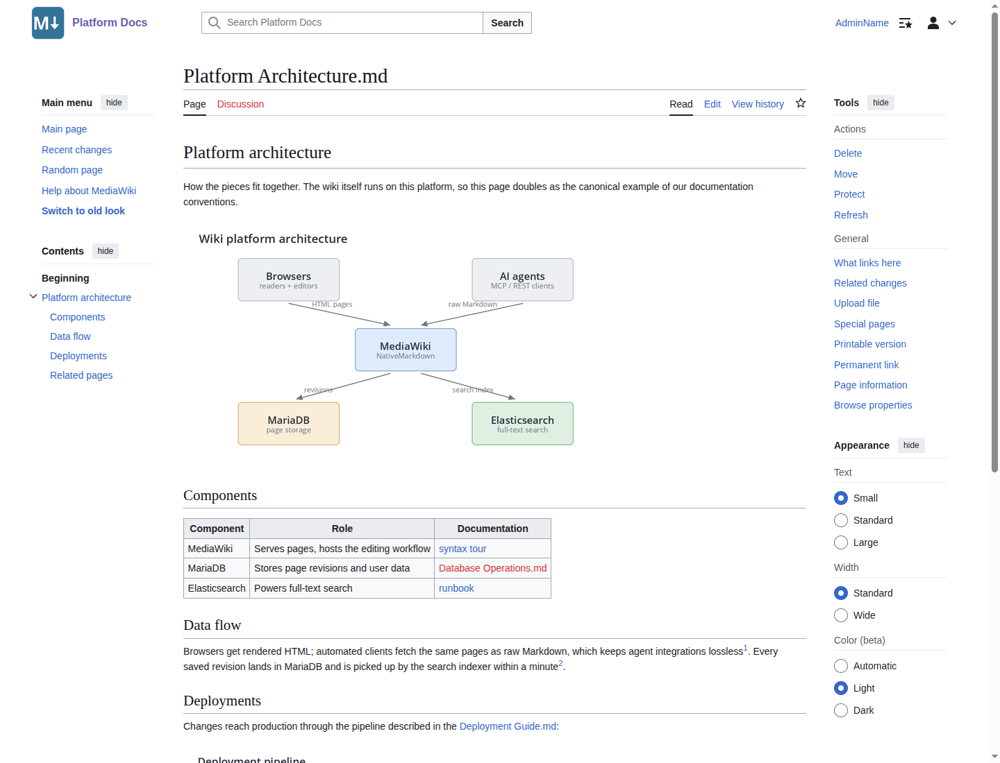
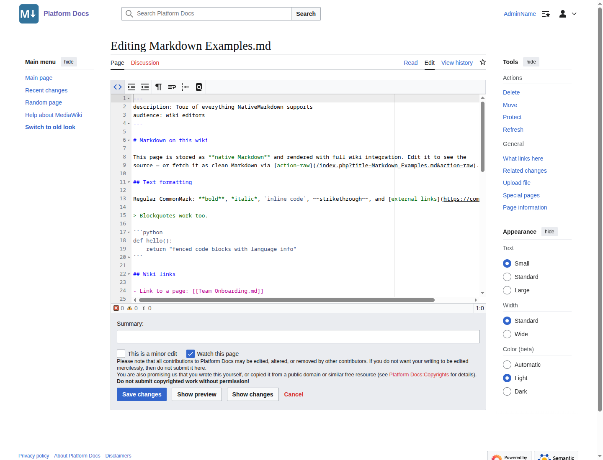

# Native Markdown

[](https://github.com/ProfessionalWiki/NativeMarkdown/actions?query=workflow%3ACI)
[](https://codecov.io/gh/ProfessionalWiki/NativeMarkdown)
[](https://shepherd.dev/github/ProfessionalWiki/NativeMarkdown)
[](psalm.xml)
[](https://packagist.org/packages/professional-wiki/native-markdown)
[](https://packagist.org/packages/professional-wiki/native-markdown)
[](LICENSE)

[MediaWiki] extension that makes Markdown a **native content model**: whole pages are stored and edited as
Markdown and rendered with real wiki integration (internal links, categories, table of contents and search),
coexisting with wikitext pages on the same wiki.

Because pages are stored as plain Markdown, they are directly consumable and writable by LLMs and agents:
`action=raw` returns clean Markdown, no wikitext conversion needed.
See [For AI agents and LLMs](#for-ai-agents-and-llms).

**Status: pre-release.** Configuration and behavior can still change.

- [Introduction to the extension](https://professional.wiki/en/extension/native-markdown#Overview)
- [Usage documentation](https://professional.wiki/en/extension/native-markdown#Usage)
- [Installation](#installation)
- [Configuration](#configuration)
- [Template transclusion](#template-transclusion)
- [For AI agents and LLMs](#for-ai-agents-and-llms)
- [Comparison with other Markdown extensions](#comparison-with-other-markdown-extensions)
- [Development](#development)
- [Release notes](#release-notes)

Get professional support for this extension via [Professional Wiki], its creators and maintainers.
We provide [MediaWiki Development], [MediaWiki Hosting], and [MediaWiki Consulting] services.

## Usage

A Markdown page renders as a normal wiki page: MediaWiki table of contents, blue and red internal links,
category assignment and working search, while `action=raw` returns the Markdown source.



Editing uses the standard edit form. With the [CodeEditor extension] installed, Markdown pages get syntax
highlighting; Show preview renders through the full pipeline:



See the [full usage documentation](https://professional.wiki/en/extension/native-markdown#Usage) for the
Markdown syntax, wiki-link reference, and page behavior notes.

## Installation

Platform requirements:

* [PHP] 8.1 or later
* [MediaWiki] 1.43 or later

**Not yet published to Packagist.** Once released, installation uses [Composer] with
[MediaWiki's built-in support for Composer][Composer install].

On the command line, go to your wiki's root directory. Then run these two commands:

```shell script
COMPOSER=composer.local.json composer require --no-update professional-wiki/native-markdown:~1.0
```
```shell script
composer update professional-wiki/native-markdown --no-dev -o
```

Then enable the extension by adding the following to the bottom of your wiki's [LocalSettings.php] file:

```php
wfLoadExtension( 'NativeMarkdown' );
```

For Markdown syntax highlighting in the editor, also install the [CodeEditor extension].

## Configuration

New pages use the Markdown content model where the wiki's configuration says so. Defaults apply to page
creation only; existing pages never change model implicitly. Individual pages can be switched between
wikitext and Markdown (in both directions) via `Special:ChangeContentModel`.

| Setting | Default | Effect |
|---|---|---|
| `$wgNativeMarkdownNamespaces` | `[]` | Namespace IDs in which new pages default to Markdown, e.g. `[ NS_HELP ]` |
| `$wgNativeMarkdownEverywhere` | `false` | New pages everywhere default to Markdown, the "Markdown wiki" mode (see exclusions below) |
| `$wgNativeMarkdownSuffixDetection` | `false` | New pages whose title ends in `.md` default to Markdown, in every namespace |
| `$wgNativeMarkdownAllowExternalImages` | `false` | Embed external `` images; when off they render as plain links |
| `$wgNativeMarkdownTemplateTransclusion` | `false` | Expand `{{template}}` calls on Markdown pages; when off they stay literal text (see [Template transclusion](#template-transclusion)) |

`$wgNativeMarkdownEverywhere` covers the whole prose wiki, but deliberately leaves some pages as wikitext: the
discussion (Talk) namespaces, where signatures and threading depend on wikitext; the Template and MediaWiki
namespaces; and any namespace whose content model is explicitly configured elsewhere (for example a Scribunto
or JSON namespace). Titles ending in `.css`, `.js` or `.json` never default to Markdown either, since MediaWiki
reserves those for code pages. External links honor the core `$wgNoFollowLinks` setting. Input size is bounded
by core's `$wgMaxArticleSize`.

## Template transclusion

By default `{{...}}` is literal text on a Markdown page. Set
`$wgNativeMarkdownTemplateTransclusion = true` to expand template calls instead, so Markdown pages can reuse a
wiki's shared infoboxes, citations and navboxes:

```markdown
{{Infobox person
| name = Ada Lovelace
| born = 1815
}}

Ada Lovelace was an English **mathematician**, regarded as the first computer programmer.
```

Expansion delegates to MediaWiki's own parser, so template dependencies are tracked (editing a template
reparses the pages that transclude it), recursion and size limits apply, and the output is sanitized exactly
as wikitext is. Because it is the real parser, enabling this **also enables parser functions and magic words**
inside the braces (`{{#if:}}`, `{{PAGENAME}}`, and so on).

Placement follows the split between block and inline content:

- A call on its **own line** produces block output, so an infobox table renders as a block rather than being
  wrapped in a paragraph. It may span multiple lines, including blank parameter lines, until the braces balance.
- A call **within a line** of text renders inline and must stay on a single line; multi-line calls have to
  start on their own line.
- Template arguments are wikitext, not Markdown. Inside a GFM table cell, escape argument pipes as `\|`. Write
  `\{\{` to keep braces literal.
- A block call with no closing `}}` is rendered as literal text through to the end of the page (Markdown
  parsing cannot backtrack), so a forgotten brace shows up as visible braces to fix rather than a silent error.

Out of scope in this version, by design:

- `<ref>...</ref>` and `<references/>` in the Markdown body (these are tags, not `{{...}}`), and citation
  state is not shared across separate calls on a page.
- Transcluding another **Markdown** page with `{{:Page}}`: its source would be reinterpreted as wikitext, so
  transclude wikitext pages instead. `subst:` does not substitute on save.
- Enabling the setting does not reparse existing pages; they show template output once edited or purged. Run
  `refreshLinks.php` to populate the template links eagerly.

## For AI agents and LLMs

Markdown is the native read/write format of today's language models, and Native Markdown stores pages as
exactly that: plain Markdown, no wikitext wrapper. That makes a Markdown page directly consumable and
directly writable by an agent, with no lossy conversion step in either direction:

- **Read the source** with `action=raw`:

  ```
  GET /index.php?title=Release_Notes.md&action=raw
  ```

  returns the raw Markdown, front matter and all, exactly the bytes an author typed.

- **Read via the REST API**, which also reports the model:

  ```
  GET /rest.php/v1/page/Release_Notes.md
  → { "content_model": "markdown", "source": "# Release Notes\n...", ... }
  ```

- **Read the rendered HTML** with `action=parse` (`?action=parse&page=Release_Notes.md&prop=text`), for when
  an agent wants the resolved links and table of contents rather than the source.

- **Write** through the ordinary editing APIs (`action=edit`, the REST update endpoint) or, more
  conveniently, through the [MediaWiki MCP Server]: an agent hands over Markdown and it is stored verbatim,
  rendered with full wiki integration on read.

Because the round trip is lossless, an agent can fetch a page as Markdown, edit it, and write it back without
the content drifting through a wikitext translation. Full-text search indexes the rendered prose (not the raw
markup), so an agent's keyword lookups match what a reader sees rather than `#` and `**` noise.

## Comparison with other Markdown extensions

Native Markdown exists because no maintained extension makes Markdown a native content model:

- **[Extension:WikiMarkdown]** embeds Markdown blocks inside wikitext pages via a tag, plus a shallow `.md`
  content handler on top of Parsedown. Inside the Markdown there are no working `[[wiki links]]`, no category
  assignment and no MediaWiki table of contents. Native Markdown makes the whole page Markdown, with links,
  categories, ToC, search and link tables behaving like they do on wikitext pages.
- **[Extension:Markdown]** is archived and points visitors to WikiMarkdown.
- **[MarkdownExtraParser]** has been unmaintained for over a decade.

Related but different: our [ExternalContent extension] embeds Markdown *files from external sources* (like
GitHub) into wikitext pages, while Native Markdown is for the wiki's own pages being Markdown. They compose
nicely.

## Development

The Application layer (the whole Markdown pipeline) has no MediaWiki dependencies, so the unit suite runs
standalone in the extension directory with no MediaWiki install:

```shell script
composer install
composer test
```

Style checks and static analysis, also standalone: `composer cs`, `composer phpstan`, `composer psalm`.

The full suite including integration tests runs inside a MediaWiki install, from the MediaWiki root:

```shell script
php tests/phpunit/phpunit.php extensions/NativeMarkdown/tests/phpunit/
```

## Release notes

### Version 1.0.0 (not yet released)

Initial release for MediaWiki 1.43+ with these features:

* Markdown content model (`markdown`) rendering CommonMark + GitHub Flavored Markdown with footnotes
* Wikitext link syntax inside Markdown: internal links, section links, categories, file embeds, interwiki
* MediaWiki integration: table of contents, red/blue links, link tables, WhatLinksHere, WantedPages/Files
* Clean full-text search: rendered prose is indexed, not raw markup; front matter excluded
* YAML front matter parsed, hidden from output and stored as page metadata
* Per-page model switching via `Special:ChangeContentModel`, namespace/suffix/wiki-wide activation modes
* Opt-in template transclusion: `{{template}}` calls expand via the MediaWiki parser, with dependency tracking
* XSS-safe by construction: raw HTML escaped, unsafe links blocked, external images off by default
* `action=raw` / REST return the stored Markdown byte for byte, built for AI agents and git round-trips
* CodeEditor syntax highlighting on Markdown pages

[MediaWiki]: https://www.mediawiki.org
[Professional Wiki]: https://professional.wiki
[MediaWiki Development]: https://professional.wiki/en/mediawiki-development
[MediaWiki Hosting]: https://pro.wiki
[MediaWiki Consulting]: https://professional.wiki/en/mediawiki-consulting-services
[PHP]: https://www.php.net
[Composer]: https://getcomposer.org
[Composer install]: https://professional.wiki/en/articles/installing-mediawiki-extensions-with-composer
[LocalSettings.php]: https://www.mediawiki.org/wiki/Manual:LocalSettings.php
[CodeEditor extension]: https://www.mediawiki.org/wiki/Extension:CodeEditor
[MediaWiki MCP Server]: https://github.com/ProfessionalWiki/MediaWiki-MCP-Server
[Extension:WikiMarkdown]: https://www.mediawiki.org/wiki/Extension:WikiMarkdown
[Extension:Markdown]: https://www.mediawiki.org/wiki/Extension:Markdown
[MarkdownExtraParser]: https://www.mediawiki.org/wiki/Extension:MarkdownExtraParser
[ExternalContent extension]: https://github.com/ProfessionalWiki/ExternalContent
